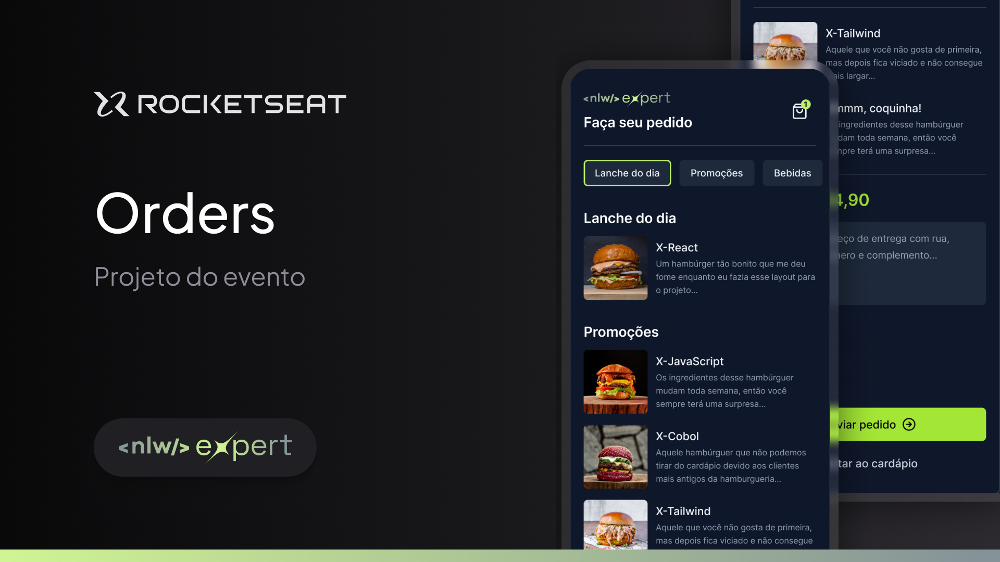

## Resumo

Projeto desenvolvido em **React Native** utilizando **Expo** para delivey. A realização dos pedidos é feita pelo app e serão enviados diretamente para o **whatsapp** do estabelecimento!

## Tecnologias utilizadas

- Zustend
- Expo
- React Native
- Expo Router
- AsyncStorage
- Tailwind (Nativewind)
- TypeScript
